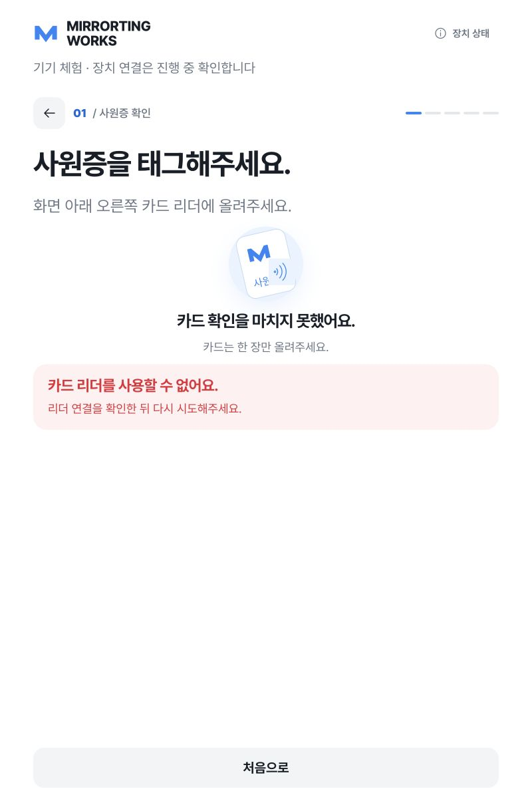
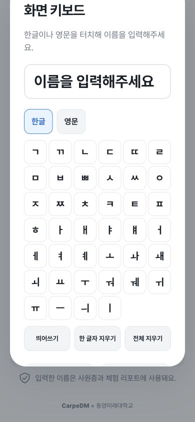

# 전체 실행 점검 · 2026-10-05

> 수정 전 점검 이력이다. 카메라 권한 대기·스트림 종료·장치 상태 갱신·샘플 완료 안내 등의 후속 수정과 최종 검증은 [전체 점검 및 수정 결과](AUDIT_FIXES_2026-10-05.md)를 따른다.

## 1. 현재 문제 요약

운영 기준 정정: 라즈베리파이 전용, 물리 키보드 필수다. 모바일 화면 키보드 문제는 운영 약점에서 제외하며 화면 키보드는 제거했다. 아래 모바일/터치 키보드 결과는 제거 전 점검 이력이다.

대상은 실제 8002 서버의 작업 디렉터리인 `CarpeDM_EXPO_IDPrinter-complete`이다. 소프트웨어 테스트는 모두 통과했지만 실제 전시의 입사→스마트미러→퇴근 연결은 현재 환경에서 완주할 수 없다. NFC는 disabled, 프린터는 screen 미리보기, MirrorTing은 미설정이다. 이것은 장비 고장 판정이 아니라 현재 실행 설정의 검증 결과다.

### 우선순위와 근거

| 우선순위 | 약점 | 확인 방법 / 영향 | 권장 조치 |
| --- | --- | --- | --- |
| P1 · 현장 인수 | 실물 NFC·출력·MirrorTing 연결 미검증 | `/api/health`: NFC disabled, printer screen, mirrorting configured=false. `preflight.py --hardware` 실패. 실제 퇴근에서 리더 오류 표시를 브라우저로 확인 | Pi의 실제 장치 설정과 상대 서버 적용 후 입사→체험→퇴근 전체 연결 검증 |
| P1 · 코드 확인 | 웹 미리보기 카메라 권한 대기 시간 제한 없음 | `frontend/js/app.js:241–285`: 초기 getUserMedia Promise를 먼저 await한다. 권한 창에 응답하지 않으면 `Camera.start()`의 15초 타이머에 도달하지 못한다. presentation 모드는 idle reset도 제외된다 | 권한 요청을 기존 Camera 경로로 통합하거나 동일한 제한 시간·늦게 도착한 스트림 정리 적용. 실제 권한창 방치 재현은 이번 점검에서 수행하지 않음 |
| 운영 범위 제외 · 제거 전 이력 | 모바일 장치 모드의 모달 위치 불안정 | `/`에서 390×844 → 출근 → 개발팀 → 이름 → 화면 키보드. 자동 스크롤 이후 scrollY=137.5, 대화상자 top=-26.45px. 상단 잘림과 하단 완료 버튼의 내부 스크롤 필요. `web.css:140–141`의 fixed/배경 스크롤 잠금이 web 모드에만 적용 | 반응형 kiosk 모드에도 모달을 뷰포트에 고정하고 배경 스크롤 잠금 적용. 800×1280 키보드는 정상 위치, 키 60.25×58px |
| P2 · 코드 확인 | 장치 상태가 첫 로딩 결과에 고정 | `app.js:792–805`에서 health를 한 번만 조회. 상태 창 열기/홈 초기화 시 다시 조회하지 않음 | 장치 상태 창을 열 때 재조회. 서버 복구·장치 재연결 이후 현재 정보 표시 |
| P2 · 화면 재현 | 샘플 완료 안내가 실제 카드 등록을 전제로 함 | A/B 샘플 완료는 '실물 카드 등록과 출력은 없었어요'와 '등록한 카드를 가지고 스마트미러로 이동해주세요'를 함께 표시. `views.js:199` | 샘플 완료의 다음 행동을 화면 체험 종료/실제 부스 안내로 구분 |

### 추가 코드 위험 · 실물 재현 필요

- `frontend/js/camera.js`는 시작 실패와 API 오류를 처리하지만 MediaStreamTrack의 ended 또는 스트림 inactive를 감지하지 않는다. 영상 정지·연결 해제 시 마지막 프레임의 검출/촬영이 이어질 가능성이 있다. 실제 Camera Module 3 연결 중단으로 재현하고, 트랙 종료 시 촬영을 막는 처리가 필요하다. 이번 점검에서 실제 카메라 연결 중단은 수행하지 않았다.
- AI A의 현장 보정 데이터가 없다(`calibrated=false`, `mu_real_n=0`). 기능 오류나 정확도 저하를 확정할 근거는 없지만 전시장 조명과 실제 방문자 사진의 결과 일관성은 별도 검증해야 한다.
- 65개 Python 테스트에서 Starlette/httpx 사용 중단 예정 경고 1건. 현재 테스트 실패는 아니다.

## 2. 수정 방향

우선 실제 서비스 연결을 인수하고, 카메라 권한 대기와 연결 중단 처리를 검증한다. 그 뒤 모바일 모달, 장치 상태 갱신, 샘플 완료 카피를 작은 변경으로 개선한다. 이번 요청은 점검이므로 애플리케이션 코드는 수정하지 않았다.

## 3. 수정 파일 목록

이번 점검에서 추가한 파일만:
- `docs/qa/AUDIT_2026-10-05.md`
- `docs/qa/audit-nfc-offline-2026-10-05.png`
- `docs/qa/audit-mobile-keyboard-2026-10-05.png`

기존 app/views/styles/tests/구현 상태 문서의 미커밋 변경은 이전 작업 상태이며 그대로 보존했다.

## 4. 최종 코드

코드 수정 없음. 이 보고서와 재현 스크린샷이 점검 결과물이다.

## 5. 실행 방법

프로젝트 디렉터리에서 `.venv/bin/python scripts/run_kiosk.py` 실행. 이번 점검은 기존 `http://127.0.0.1:8002/` 서버를 사용했다. 다른 서버는 중지하지 않았다.

- 실제 장치 흐름: `/`
- 고정 샘플: `/?sample=1&controls=1`
- 출력 실패 재현: `/?sample=1&controls=1&scenario=printer_error`

## 6. 테스트 방법과 실제 결과

| 점검 | 결과 |
| --- | --- |
| `npm test` | 37 passed |
| `.venv/bin/python -m pytest tests integrations/mirrorting/test_bridge_client.py -q` | 65 passed, 경고 1건 |
| `.venv/bin/python -m pip check` | No broken requirements found |
| `.venv/bin/python scripts/preflight.py` | Python·의존성·모델·캐릭터·한글 폰트 모두 PASS |
| `.venv/bin/python scripts/preflight.py --hardware` | 실제 NFC·실물 출력 설정 FAIL |
| 실행 서버 `/api/health` | YuNet/SFace/프로필 엔진/8개 캐릭터/SQLite 정상; 보정 없음; 장치·보고서 미연결 |
| 합성 빈 JPEG → 실제 detect API | 200, count=0 |
| 합성 빈 JPEG → 실제 match API | 200, no_face |
| 합성 빈 JPEG → 실제 profile API | 422, NO_PERSON, retryable=true |
| 800×1280 샘플 A | 팀→이름→AI→촬영→결과→NFC→출력 완료 |
| 800×1280 샘플 B | 터치 키보드 ㄱ+ㅏ→가, B 결과→등록→출력 실패→재시도 완료. 이름/팀 유지 확인 |
| 800×1280 샘플 퇴근 | 카드→별도 샘플 방문자→기록→리포트→출력 완료 |
| 이전 방문자 초기화 | A의 점검자/개발팀이 다음 B 또는 퇴근 방문자 화면에 나타나지 않음 |
| 800×1280 실제 퇴근 | NFC 미연결 오류, 성공으로 전환하지 않음; 홈 복귀 제공 |
| 800×1280 샘플 리포트 | 가로 넘침 없음, 깨진 이미지 없음, 출력 버튼 bottom=1228px로 화면 안에 위치 |
| 390×844 실제 홈 | 가로 넘침 없음, 출근/퇴근 버튼 높이 88px. 푸터까지 포함한 문서 높이 875px |
| 390×844 팀 모달·키보드 | 가로 넘침 없음; 키보드 상단 잘림 재현 |
| 점검 탭 콘솔 | 수집된 오류/경고 없음 |

실제 사진 촬영·AI B 결과 품질·Pi 처리시간·NFC 태그·종이 배출/커터·MirrorTing 실제 보고서·장시간 연속 사용은 이번 점검으로 검증하지 않았다. 고정 샘플 완주를 실제 서비스 완주로 해석하면 안 된다. 전용 번들 빌드 스크립트가 없는 vanilla frontend이며 `npm test`를 빌드 검증으로 표현하지 않는다.

## 7. 예상 결과

확인한 샘플 흐름과 오류 복구는 시연 가능하다. 실물 전시 완료 판정은 장치 연결 및 카메라/AI 품질, 실제 MirrorTing 연동 인수가 끝난 뒤 가능하다. 현 시점에 '약점 없음'이라고 판단할 수 없다.

## 8. 추가 개선 가능 사항

카메라 권한 무응답/연결 종료, 서버 끊김→복구→상태 재조회, 모바일 스크롤 후 모달을 회귀 시나리오로 추가한다. 현장에서는 NFC 카드 재사용과 출력 결과 불명 복구를 포함한 반복 체험 횟수·실패·복구 기록을 남긴다.

### 재현 화면

