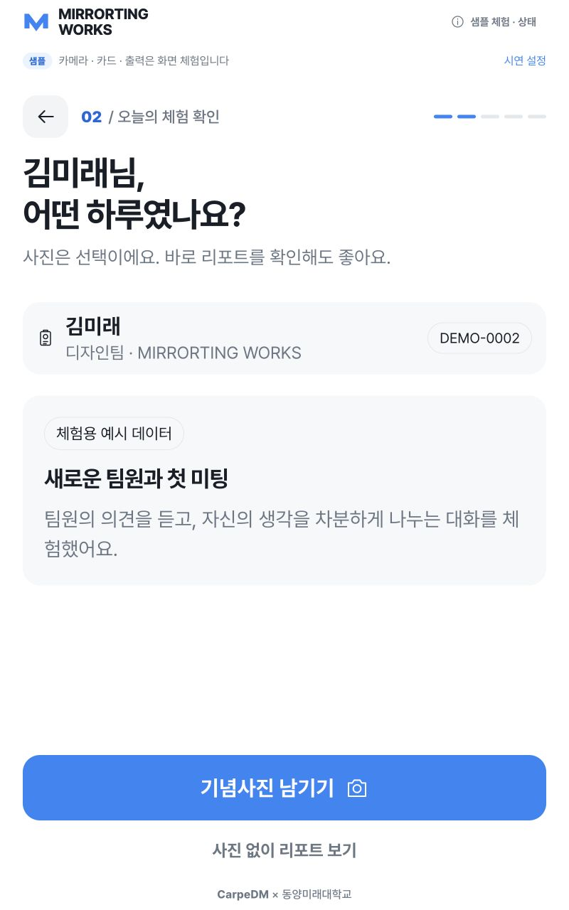
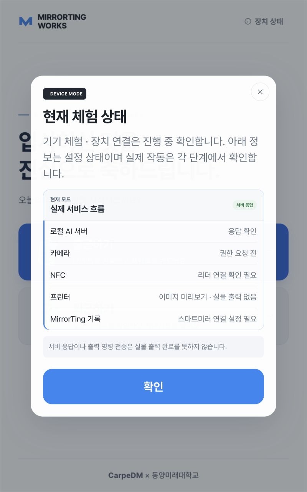
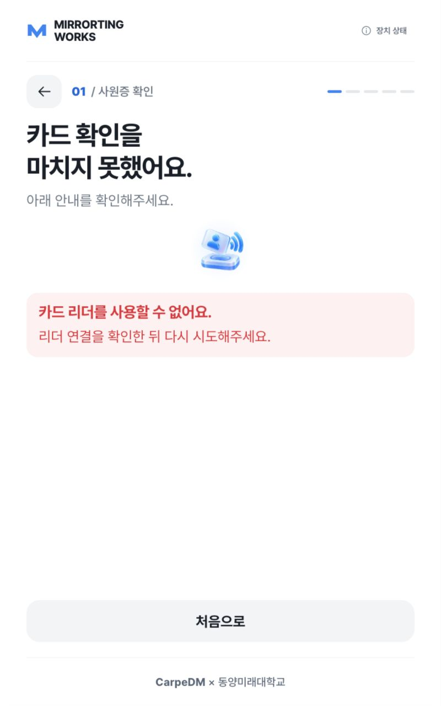
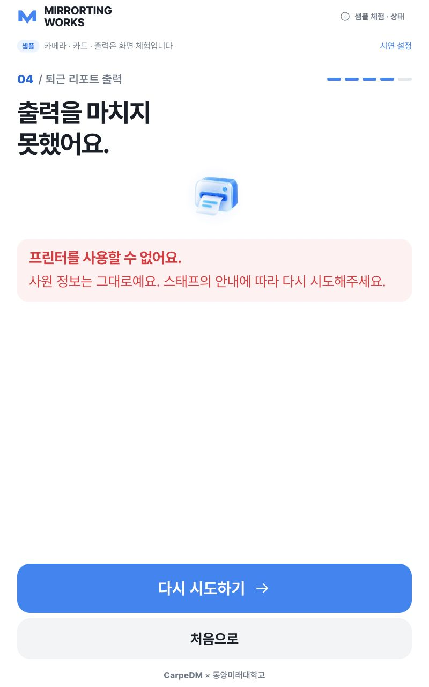
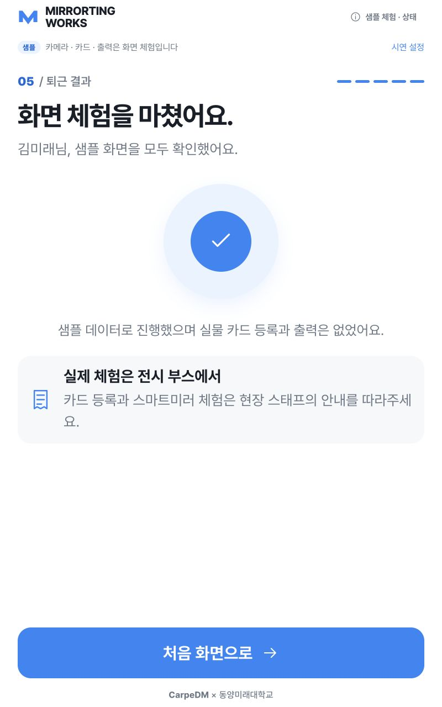
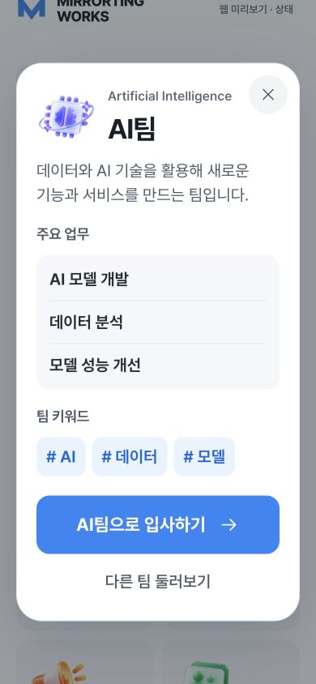

# 전체 점검 및 수정 결과 · 2026-10-05

## 1. 현재 문제 요약

대상은 8002 서버의 `CarpeDM_EXPO_IDPrinter-complete`, `codex/complete-kiosk` 작업본이다. 이전에 스테이징한 UI·자산·문서 변경을 보존하고, 확인한 소프트웨어 약점을 수정했다. 이 기록이 같은 날짜의 수정 전 `AUDIT_2026-10-05.md`보다 최신이다.

| 확인한 약점 | 최종 변경 |
| --- | --- |
| 웹 미리보기의 별도 권한 요청이 끝나지 않으면 카메라의 시작 제한 시간에 도달하지 못함 | 홈의 선행 권한 요청을 제거하고 촬영 화면에서 공통 Camera 경로로 시작. 15초 제한과 늦은 스트림 정리 적용 |
| 카메라 연결 종료 후 마지막 프레임과 늦은 감지 응답이 남을 수 있음 | 트랙 종료/스트림 비활성 감지, 감지 요청 취소, 스트림 해제, 종료된 스트림 촬영 차단. 방문자가 떠난 뒤 인코딩된 프레임도 거부 |
| 장치 상태가 최초 응답에 고정됨 | 상태 창 열기와 홈 초기화 때 재조회. 진행 중 요청은 공유하고 캐시 사용 금지. 현재 입력·카메라·사진을 다시 렌더링하지 않고 헤더·상태 창만 갱신, 포커스 복귀 유지 |
| 샘플 완료에서 실제 등록한 카드를 가져가라고 안내함 | 샘플 종료와 현장 체험 안내를 구분. 중복 완료 제목 제거 |
| 기념사진이 선택인데 기록 화면에서 바로 건너뛰는 행동이 없음 | `기념사진 남기기`와 `사진 없이 리포트 보기`를 함께 제공 |
| 오류 화면의 여러 제목과 정상 카드 태그 안내가 원인·복구 행동을 분산함 | AI·NFC·출력 오류에서 중복 상태 설명 제거. 실패 원인과 재시도·홈·작업 상태 확인을 유지 |
| 상태 정보의 작은 글씨·낮은 대비, 처리 중에도 활성처럼 보이는 시연 설정 | 장치 상태 행 20px, 보조 안내 18px. 작은 상태 글씨의 대비 개선. 시연 설정 48px 터치 영역, 처리 중 헤더 버튼 모두 잠금 |

## 2. 수정 방향

기존 FastAPI·vanilla JavaScript·6개 팀·800×1280 운영 기준을 유지한다. 공통 카메라와 기존 상태 조회/화면 렌더러를 재사용했다. NFC·출력·세션·MirrorTing API 계약과 출력 중복 방지 정책은 바꾸지 않았다. 기존 디자인을 전체 교체하지 않고 오류 안내와 가독성을 다듬었다.

## 3. 수정 파일 목록

- `frontend/js/app.js`: 카메라 진입, 상태 갱신, 포커스와 처리 중 잠금.
- `frontend/js/camera.js`: 스트림 종료와 늦은 응답/프레임 차단.
- `frontend/js/api-client.js`: 상태 조회 캐시 금지.
- `frontend/js/views.js`: 샘플·선택 사진·오류·완료 안내.
- `frontend/styles/kiosk.css`, `frontend/styles/web.css`: 터치 영역, 상태 글씨와 대비.
- `frontend/kiosk.html`: 수정 자산 버전 갱신.
- `tests/frontend/kiosk.test.mjs`: 카메라 종료/늦은 프레임, 최신 상태 요청, 샘플·선택 사진 회귀 검사.
- `docs/UI_STATE_SPEC.md`, `docs/SCREEN_DEFINITION.md`, `docs/IMPLEMENTATION_STATUS.md`, `docs/qa/`: 현재 동작과 검증 기록.

## 4. 최종 코드

코드는 위 파일에 직접 적용했다. 카메라 시작 제한은 기존 15초, 서버 상태 조회 제한은 기존 4초다. 감지 실패를 샘플 성공으로 바꾸지 않는다. 출력 결과가 불명확하면 기존 `UNKNOWN_OUTCOME` 상태와 운영자 확인 절차를 계속 따른다.

## 5. 실행 방법

프로젝트 폴더에서 `.venv/bin/python scripts/run_kiosk.py`를 실행하고 `http://127.0.0.1:8002/`를 연다. 이번 점검은 이미 실행 중인 서버를 사용했으며 현재 환경은 NFC disabled, 프린터 screen 미리보기다.

- 장치 흐름: `/`
- 고정 샘플: `/?sample=1&controls=1`
- 오류 사례: 샘플 URL에 `&scenario=printer_error`, `nfc_error`, `camera_error`, `ai_error`, `ai_timeout`, `no_person`, `multiple_people`, `unknown_card`, `no_report`, `fatal` 사용.
- 웹 미리보기: `/?preview=1`. 운영 대상은 여전히 라즈베리파이와 물리 키보드다.

## 6. 테스트 방법과 실제 결과

| 확인 | 결과 |
| --- | --- |
| `npm test` | 최종 41 passed |
| `.venv/bin/python -m pytest tests integrations/mirrorting/test_bridge_client.py -q` | 65 passed. 백엔드는 이번 수정에서 변경하지 않음 |
| 변경 JavaScript의 `node --check`, `git diff --check` | 통과 |
| `.venv/bin/python -m pip check` | No broken requirements found |
| `.venv/bin/python scripts/preflight.py` | Python·의존성·모델·인쇄 자산·한글 폰트 PASS |
| 실제 `/api/health` | AI 응답 정상. NFC disabled, 프린터 screen, MirrorTing configured=false |
| 800×1280 팀 | 6개 팀 모두 업무 3개·키워드 3개, 키워드 26px. 팝업 높이 773~812px로 화면 안에 위치 |
| 이름 | 빈 입력 차단, 11자 차단, 10자 한글 결과 카드 가로 넘침 없음. 상태 창 이후 이름 유지 |
| 샘플 입사 | 팀→이름→촬영→캐릭터→NFC→출력→완료. NFC 오류 재시도에서 이름·팀 유지 후 홈 복귀 |
| 샘플 퇴근 | 카드→기록→사진→확인→리포트→출력→완료. 사진 생략으로 바로 리포트 진입도 확인 |
| 오류 복구 | 카메라 오류 후 연결, AI 오류·시간 초과 후 재촬영, NFC 오류 및 미등록 카드 재시도, 출력 오류 재시도, 점검 화면 홈 복귀 |
| 누락 기록 | 사진/리포트 출력 행동 제공하지 않음. 실제 NFC 미연결은 오류로 유지하고 홈 복귀 제공 |
| 유휴 | 실제 장치 모드에서 45초 이후 경고와 카운트다운 관찰. 60초 이후 홈 복귀와 이전 이름 제거 확인 |
| 상태 창 | 배경 입력 차단, 닫기 48px, 이름 보존. 상태 행 20px·보조 안내 18px, 팝업 높이 887px로 화면 안에 위치 |
| 대비 | 현재 모드 글씨 5.65:1, 확인 필요 상태 글씨 6.39:1 |
| 390×844 웹 미리보기 | 팀 팝업 높이 약 689px·키워드 20px·가로 넘침 없음. 상태 창 이후 입력 이름 유지 |
| 브라우저 로그 | 점검한 샘플·웹 미리보기·실제 장치 모드에서 수집된 오류/경고 없음 |

카메라 권한 무응답, 트랙 종료, 늦은 감지/인코딩 응답은 제어된 단위 테스트로 검증했다. 실제 브라우저 권한 창 방치나 Camera Module 3의 물리적 연결 해제 재현을 수행했다는 의미는 아니다. 서버 중단→복구를 실물 서버에서 강제로 재현하지 않았으며, 최신 조회 요청·실행 서버 상태 창·입력 보존을 확인했다.

Python 검사에서 Starlette/httpx 사용 중단 예정 경고 1건이 있다. 현재 테스트 실패는 아니다. 전용 번들 빌드 명령은 없으므로 `npm test`를 빌드 검사라고 부르지 않는다.

`audit-fixes-layouts-2026-10-05.json`에는 800×1280에서 측정한 화면·버튼 경계·이미지 로딩 결과를 보관한다. 측정한 주요 행동 버튼이 화면 밖으로 잘리지 않았다.

## 7. 예상 결과

확인한 소프트웨어 약점은 수정됐고 샘플 시연과 오류 복구 흐름이 이어진다. 실제 종합 전시가 약점 없이 완성됐다는 판정은 실물 인수가 끝난 뒤 가능하다.

## 8. 추가 개선 가능 사항 / 남은 실물 검증

- Raspberry Pi 터치·물리 키보드 한글 IME·설치 거리의 가독성.
- 실제 촬영, 조명 변화, 카메라 연결 해제, AI 결과 품질·Pi 처리 시간.
- ACR1252U 실물 카드 등록/재사용과 ZTP-80USL2 용지 배출·절단·출력 불명 복구.
- MirrorTing 동반 패치와 실제 서버 설정 후 입사→스마트미러→퇴근 연결.
- 기념사진은 화면 미리보기 전용이다. 사진 종이 인쇄는 연결되지 않았다.
- 장시간 반복 운영과 실물 장치의 실패·복구 기록.

### 수정 화면

