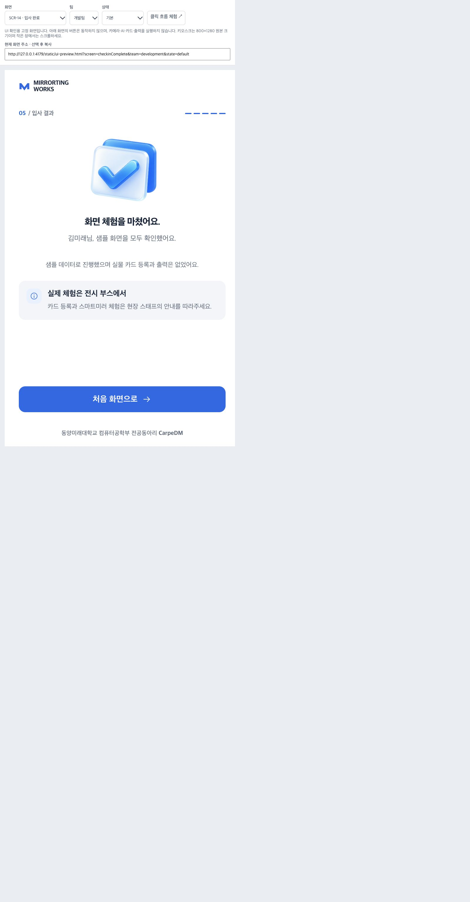
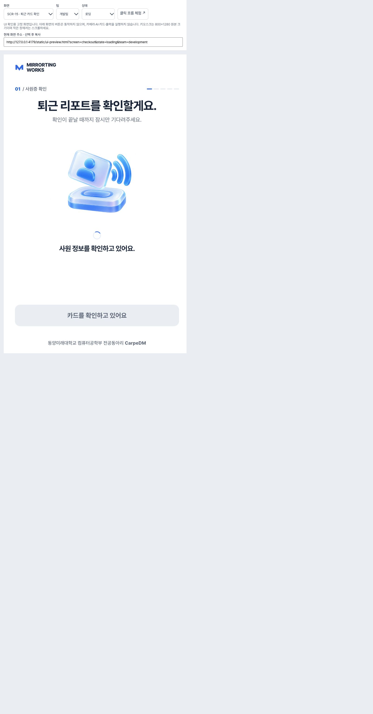
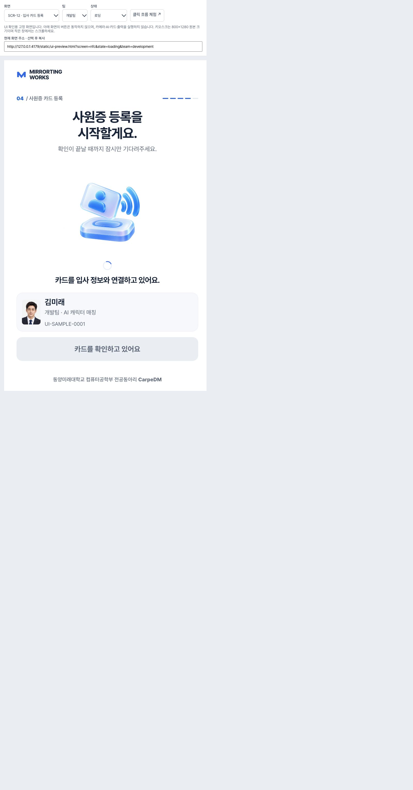

# Touch and click UI · 2026-10-08

## Changes

- Removed hover, decorative artwork animations, screen slides and button press scaling. Press feedback uses background color. Loading indicators, operation locks, name validation and keyboard focus remain.
- Removed decorative outlines from entry/team/result/identity/record/report/error panels and header/footer chrome. Primary buttons share the brand blue and 22px radius. Input focus uses one blue border; invalid input uses red.
- Replaced the completion SVG with a transparent glass/acrylic PNG generated using existing project icons as references. Both completion screens reuse the existing artwork helper.

## Verification

- `npm test`: 50 passed, including RGBA asset checks for both completion screens.
- `node --check frontend/js/app.js`, `node --check frontend/js/views.js`, `git diff --check`: passed.
- Browser CSS viewport measured at 800×1280. All 18 kiosk gallery entries checked in default/error/unknown variants: 54 combinations, no horizontal overflow, clipped visible buttons or buttons under 48px high. Inspected artwork had no decorative animation.
- All nine web gallery entries checked at measured 390×844: no horizontal content overflow.
- Clicked through sample Home → team → name → matching introduction → capture → analysis → result → registration/print → completion → Home. Name entry used a keyboard; other actions used clicks. Busy registration disabled duplicate actions.
- Final completion PNG loaded at its 1254px source width. Its home button has no border, a 22px radius and fits inside the screen.
- This verifies browser presentation and sample flow. Physical touch panel, camera, NFC and printer operation were not tested.

## Loading and layout follow-up

- Kiosk and sample CSS now share artwork/camera/profile dimensions. Checkout NFC artwork is centered in a 400px square.
- Analysis, NFC and print loading indicators use one reserved row above status copy. NFC no longer repeats the spinner inside its button. Decorative motion CSS is not loaded.
- Pending report fetches hide previously available content/actions; a regression test covers this state.
- Browser at measured 800×1280: all 18 kiosk entries in default/loading/error/unknown states (72 combinations), no adjacent top-level content overlap, clipped buttons or horizontal overflow.
- Browser at measured 390×844: nine web entries in default/loading/error states (27 combinations), no horizontal overflow.
- Actual sample checkout renders a 400px artwork area with its primary button inside the screen. NFC and analysis indicators rotate while artwork and analysis points stay still.
- Hardware and physical touch remain untested.

