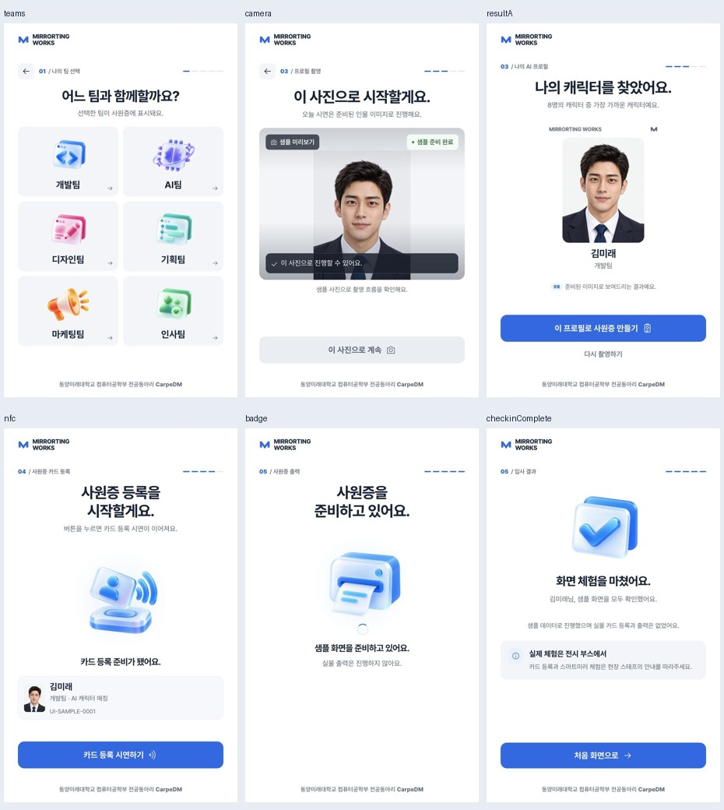

# Visitor kiosk UI · 2026-10-08

## Final presentation

- Shared white, navy, blue and pale gray palette with minimal shadows.
- Centered scene headings; input and report text keep readable alignment.
- Team selection: 152px artwork, team name and arrow in a 2×3 grid of minimum 240px cards. Descriptions remain available through accessible labels.
- Character introduction: eight large portraits and a short instruction. No process toggle or technical step list.
- Kiosk result: 280×360px profile with centered visitor identity.
- NFC and printer scenes: 340px artwork, explicit state, compact identity and clear action.
- Artwork entry: 480ms, up to 8px translation; content never fades out during navigation. Home floating: different 6/6.8-second cycles, up to 5px. Device floating: 4.8-second cycle during processing only. Completion settles once in 520ms. Captured and result photos remain still. Existing reduced-motion rules disable these effects.
- Footer consistently names `동양미래대학교 컴퓨터공학부 전공동아리 CarpeDM`.
- Camera, API, operation locks, physical-output truth and session reset contracts are retained.

## Verification

- `npm test`: 48 frontend tests passed, including removal of the process toggle.
- `node --check frontend/js/views.js` and `git diff --check`: passed.
- Browser: all 27 gallery entries checked in default/loading/error/empty/unknown variants (135 rendered combinations). Kiosk canvas remained 800×1280; no horizontal content overflow or clipped visible buttons in the final state.
- The enlarged photo-review scene initially clipped the skip action. After reducing its image height to 360px, all five variants were checked again and passed.
- All nine web gallery entries checked at measured CSS viewport 390×844: no horizontal content overflow and no process toggles.
- Sample check-in: Home → team → name → character introduction → sample capture → analysis → result → card-registration sample → print sample → completion.
- Sample checkout: Home → card-read sample → record → skip optional photo → report → print sample → completion.
- Browser warning/error logs were empty in the inspected gallery and sample flow.
- Motion names and timing verified from computed artwork styles. OS reduced-motion behavior and physical-panel viewing distance remain onsite checks.

These checks exercise presentation and explicit fixed-data flows. Live camera/model/NFC/printer/MirrorTing integration was not executed during this UI pass.

## Screenshot

## Review

- Gallery: `http://127.0.0.1:4179/static/ui-preview.html?screen=teams`
- Interactive sample: `http://127.0.0.1:4179/?sample=1&controls=1`

## Full review and motion follow-up

- Shortened the team title and removed duplicate guidance; enlarged team icons without overflowing the kiosk canvas.
- Card-registration copy distinguishes waiting from processing. Errors stop repeated device movement; a regression check covers errors even if a busy flag remains set.
- Centered the printer/card loading indicator beneath the artwork. No numeric progress or physical confirmation is invented.
- Removed camera-overlay backdrop blur after screenshots intermittently omitted the text. Subsequent profile and keepsake captures show readable instructions and status. Fixed sample-camera overlay text no longer claims that the camera is still initializing.
- Retained the existing completion artwork and added a single settling animation.
- Illustration motion is isolated in `frontend/styles/motion.css`, loaded by both entry HTML files; the concurrent touch-control changes remain intact. One-time effects release their transforms when finished, avoiding intermittent missing lower-row icons in full-page captures.
- Browser: all 27 entries and five state variants (135 combinations), no horizontal content overflow, kiosk screen overflow or clipped visible kiosk actions.
- Mobile web: all nine entries at measured CSS viewport 390×844; no horizontal content overflow, process toggles or visible action targets smaller than 48px.
- Shared web team/name/character-introduction screens also checked at 390×844 without horizontal overflow; team icons use the intended 112px mobile size.
- Computed styles confirm one-time waiting/completion entry, repeated device movement only in loading states, and no result/keepsake photo animation.
- Sample check-in and photo-free checkout reached completion through the actual controls. Gallery and flow error logs were empty. Digital-card preview generated a 900×1200 PNG in browser memory.
- `npm test`: 49 frontend tests passed. JavaScript syntax and `git diff --check` passed.
- Reduced-motion cancellation is covered by existing unit tests, and shared CSS disables decorations. OS preference switching, Raspberry Pi frame rate, live camera/model and physical NFC/printing remain onsite checks.

